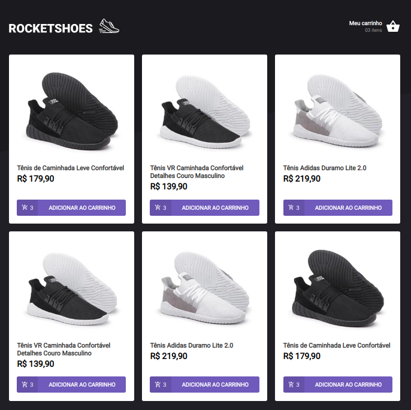

<h1>Rocketshoes :rocket::shoe: -- Arquitetura-Flux</h1>

<h2>Trabalhando com Redux</h2>

<ul>To Build:</ul>
  <li>git clone https://github.com/wendellcalixtoo/Arquitetura-Flux.git</li>
  <li>yarn install</li>
  <li>yarn start</li>
</ul>
<ul>:runner: To run server:</ul>
    <li>$json-server server.json -p 3333</li>
<ul>:space_invader: To install Reactotron</ul>
    <li>https://github.com/infinitered/reactotron/releases</li>
